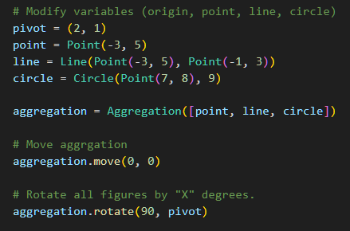
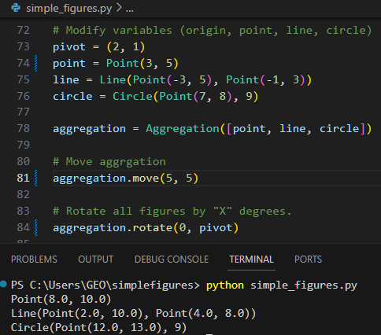

# simple-figures  

## Requirement:  
You must create a set of classes for the domain area of simple geometric figures. There are Point, Line and Circle  

All geometric figures should have methods for Move and Rotate. Methods implementation for each figure is required.  

There is an additional figure named Aggregation and it may contain random number of random figures, for example 2 Points and a Circle, or 5 Lines and a Point. When Aggregation moves all its figures move the same way.  

When Aggregation rotates all its figures rotate the same way. Write down the Aggregation implementation including the class 
definition and all methods.  

## HOW TO:  

You may alter the points x-axis and y-axis to your preference.  

  

- pivot : center of rotation (if not at origin (0, 0))  
- point : a single point in geometry grid (x, y)  
- line : a line consist of 2 points - (x, y) to (x, y)  
- circle : circle has a single point with a radius _(though radius will not change in this case)_  

Aggregation is a list that takes in point, line, circle ONLY.  
You may add as many points, line, circle variable. Do not forget to add variables into the Aggregation list if you want the move and rotate to be applied.
> (for e.g.: aggregation = Aggregation([point, point1, line, line1, line2, circle, circle1]))  
  

**MOVE**:  
You may alter the x-axis and y-axis for aggregation for it to move.
aggregation.move(x, y)  
  
**ROTATE**:  
You may ONLY alter "X" in the rotate function.
aggregation.rotate(X, pivot)  
  
Example: -  
    
Expected output:  
  

  
Noticed how rotate is modified to 0, move x-axis by 5 and y-axis by 5. All the points are shifted according to aggregation.

**_You may further verify the movement of pivot and rotation with external sources._**